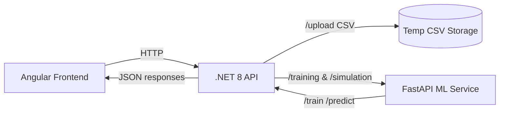

# IntelliInspect – Predictive Quality Control Platform

IntelliInspect is a full-stack, AI-powered application that simulates real-time predictive quality control for manufacturing production lines (inspired by the Bosch Production Line dataset). It lets you:

- Upload and parse production CSVs
- Validate train/test/simulation date ranges against the dataset
- Train stacking-based ML models (XGBoost, LightGBM, CatBoost + RandomForest meta-model)
- Run a live simulation to predict Pass/Fail with confidence on streaming rows

The repo contains an Angular web app, a .NET 8 Web API, and a Python FastAPI ML service.

---

## Monorepo Structure

```
team5/
  backend-dotnet/IntelliInspect.API/      # .NET 8 Web API (dataset upload, ranges, train, simulate)
  ml-service/                             # FastAPI ML service (train/predict)
  src/                                    # Angular frontend source
  public/                                 # Angular static assets
  dist/frontend/                          # Angular build output
  package.json                            # Angular app scripts/deps
  angular.json                            # Angular build/serve config
  LICENSE
  README.md
```

## Tech Stack

- Frontend: Angular 18, Angular Material, RxJS
- API: .NET 8 (ASP.NET Core Web API)
- ML Service: Python 3.10+, FastAPI, scikit-learn, XGBoost, LightGBM, CatBoost, Matplotlib

---

## Quick Start (Local Development)

### Prerequisites

- Node.js 18+ and npm 9+
- Angular CLI 18 (`npm i -g @angular/cli`)
- .NET SDK 8.x
- Python 3.10+ and pip

### 1) Start the ML Service (FastAPI)

Windows PowerShell:

```powershell
cd ml-service
python -m venv .venv
.\.venv\Scripts\Activate.ps1
pip install -r requirements.txt
uvicorn main:app --host 0.0.0.0 --port 8000
```

You should see FastAPI running on http://localhost:8000. Health checks:

```powershell
curl http://localhost:8000/health | cat
```

### 2) Start the .NET API (Backend)

Set the API to call the ML service via `ML_SERVICE_URL` and run the Web API:

```powershell
cd backend-dotnet\IntelliInspect.API
$env:ML_SERVICE_URL = "http://localhost:8000"
dotnet run
```

The API will listen on a local Kestrel port (shown in the console). CORS is open to all origins for development.

### 3) Start the Angular Frontend

From the repository root:

```powershell
npm install
npm start
```

Open the app at http://localhost:4200.

---

## How It Works



High-level flow:

- Users upload a CSV to the API. The API parses, adds a synthetic timestamp if missing, and stores a processed copy in a temp location.
- Users choose date ranges for train/test/simulation; the API validates against dataset bounds and non-overlap.
- Training sends the sliced records to the ML service, which trains base models (XGB, LGBM, CatBoost) and a RandomForest meta-model, and returns metrics and charts.
- Simulation streams rows to the ML service for predictions and returns results plus aggregate stats.

---

## Backend API

Base URL: your local .NET API port (e.g., `http://localhost:5163`)

### Upload CSV

- Method: POST `api/upload`
- Content-Type: `multipart/form-data` (field name: `file`)

Response (200):

```json
{
  "fileName": "production.csv",
  "totalRecords": 12345,
  "totalColumns": 20,
  "passRate": 0.87,
  "startTimestamp": "2021-01-01T00:00:00",
  "endTimestamp": "2021-02-01T00:00:00"
}
```

Rules:
- Only CSV files allowed
- `Response` column is required; if `synthetic_timestamp` is missing, it is generated at 1-second intervals starting 2021-01-01 00:00:00

### Validate Date Ranges

- Method: POST `api/dateranges/validate`
- Body:

```json
{
  "trainStart": "2021-01-01T00:00:00",
  "trainEnd":   "2021-01-07T23:59:59",
  "testStart":  "2021-01-08T00:00:00",
  "testEnd":    "2021-01-10T23:59:59",
  "simStart":   "2021-01-11T00:00:00",
  "simEnd":     "2021-01-12T23:59:59"
}
```

Notes:
- Ranges must be sequential and non-overlapping: `TrainEnd < TestStart < TestEnd < SimStart < SimEnd`
- Ranges must fall within dataset bounds

### Train Model

- Method: POST `api/training/train-model`
- Body:

```json
{
  "trainStart": "2021-01-01T00:00:00",
  "trainEnd":   "2021-01-07T23:59:59",
  "testStart":  "2021-01-08T00:00:00",
  "testEnd":    "2021-01-10T23:59:59"
}
```

Response (200):

```json
{
  "accuracy": 0.94,
  "precision": 0.93,
  "recall": 0.92,
  "f1Score": 0.925,
  "trainingChartBase64": "iVBORw0KGgo...",
  "confusionMatrixBase64": "iVBORw0KGgo...",
  "status": "Success",
  "message": "Stacking model trained on 1000 rows, tested on 300 rows"
}
```

### Run Simulation

- Method: POST `api/simulation/run`
- Body:

```json
{
  "start": "2021-01-11T00:00:00",
  "end":   "2021-01-12T23:59:59"
}
```

Response (200):

```json
{
  "rows": [
    {
      "timestamp": "2021-01-11 00:00:00",
      "sampleId": "1",
      "prediction": "Pass",
      "confidence": 98.45,
      "temperature": 20.1,
      "pressure": 1012,
      "humidity": 45
    }
  ],
  "stats": { "total": 1728, "pass": 1650, "fail": 78, "averageConfidence": 92.1 },
  "status": "Success",
  "message": "Simulated 1728 rows"
}
```

---

## ML Service API (FastAPI)

Base URL: `http://localhost:8000`

### Train

- Method: POST `/train`
- Body:

```json
{
  "trainData": [ { "Response": 1, "Sensor_A": 0.12, "synthetic_timestamp": "2021-01-01 00:00:00" } ],
  "testData":  [ { "Response": 0, "Sensor_A": 0.34, "synthetic_timestamp": "2021-01-08 00:00:00" } ],
  "threshold": 0.7,
  "downsample": false
}
```

Response keys: `accuracy`, `precision`, `recall`, `f1Score`, `trainingChartBase64`, `confusionMatrixBase64`, `status`, `message`.

### Predict

- Method: POST `/predict`
- Body:

```json
{
  "rows": [
    { "Id": 1, "Sensor_A": 0.12, "temperature": 20.1, "pressure": 1012, "humidity": 45, "synthetic_timestamp": "2021-01-11 00:00:00" }
  ]
}
```

Response is a list of objects: `timestamp`, `sample_id`, `prediction` (Pass/Fail), `confidence` (0–100), optional `temperature`, `pressure`, `humidity`.

---

## CSV Requirements and Tips

- Required column: `Response` (0/1). Other numeric columns are used as features automatically.
- Optional but recommended columns for richer UI: `Sensor_A`, `Sensor_B`, `Sensor_C`, `Temperature`, `Pressure`, `Humidity`.
- If `synthetic_timestamp` is missing, the API generates one per row at 1-second intervals starting `2021-01-01 00:00:00`.
- The API stores a processed copy in your OS temp directory under `intelliinspect`.

---

## Configuration

- `ML_SERVICE_URL` (env var): URL of the FastAPI service for the .NET API to call. Default: `http://localhost:8000`.
- CORS: The API enables `AllowAnyOrigin/Method/Header` for development.
- Storage: Processed CSVs are saved to the system temp folder (`%TEMP%/intelliinspect` on Windows).

`backend-dotnet/IntelliInspect.API/appsettings.json` contains a `DatasetSettings.StoragePath` example but the current implementation uses the temp directory at runtime.

---

## Frontend Scripts

From the repo root:

```bash
npm start     # ng serve (dev)
npm run build # ng build -> dist/frontend
npm test      # unit tests via Karma
```

---

## Building and Running (Summary)

- ML service: `uvicorn main:app --host 0.0.0.0 --port 8000`
- Backend: `dotnet run` in `backend-dotnet/IntelliInspect.API` (set `ML_SERVICE_URL` first)
- Frontend: `npm start` in repo root, then open `http://localhost:4200`

---

## Dockerized Deployment

Run the full stack with one command:

```bash
docker-compose up --build
```

Services and ports:

- frontend-angular: `http://localhost:4200`
- backend-dotnet: `http://localhost:8080`
- ml-service-python: `http://localhost:8000`

Notes:

- The frontend proxies `/api/*` to the backend in Nginx.
- The backend calls the ML service at `http://ml-service-python:8000` inside the compose network.
- HTTPS redirection is disabled for container use; use HTTP endpoints above.

To rebuild after code changes:

```bash
docker-compose build --no-cache && docker-compose up
```

To stop and remove containers:

```bash
docker-compose down
```

---

#  Usage Instructions

Once you clone the repository, follow these steps to run the system locally.

---

## 1. Frontend (Angular)
```bash
# From project root
ng build
ng serve
```
Runs the Angular frontend.

The terminal will display the app URL (e.g., http://localhost:4200).

---

## 2. Backend (ASP.NET Core API)
```bash
# From project root
cd backend-dotnet/IntelliInspect.API

dotnet build
dotnet run
```
Starts the backend API service.

---

## 3. Machine Learning Service (FastAPI)
```bash
# From project root
cd ml-service

python main.py
python -m uvicorn main:app --host 0.0.0.0 --port 8000 --reload
```
Runs the ML microservice on port **8000**.

---

##  Access the Application

- Open the frontend URL shown in the Angular terminal (default: http://localhost:4200).  
- The frontend will automatically connect with the backend API and ML service.

---
## Troubleshooting

- 404/connection errors from API to ML: ensure `ML_SERVICE_URL` matches the ML host/port and the ML service is running.
- CORS errors: the API has permissive CORS in development; restart the API after changes.
- CSV rejected: ensure file extension is `.csv` and the CSV includes a `Response` column.
- No predictions: you must train the model first (`/train` via the UI or API); otherwise `/predict` returns an empty list.

---

## License

This project is licensed under the terms of the LICENSE file included in the repository.
